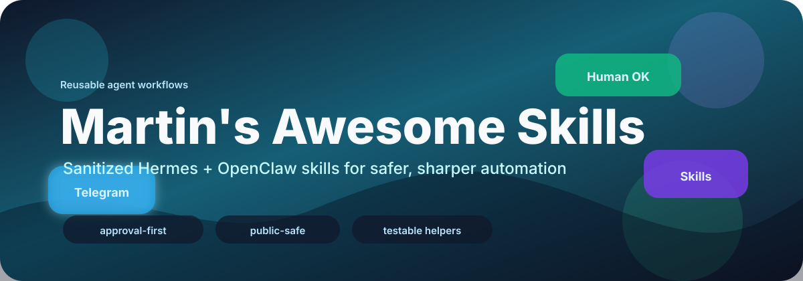
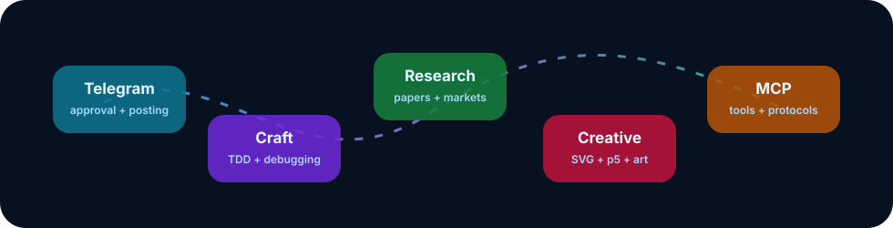

# Martin's Awesome Skills

<p align="center">
  
</p>

<p align="center">
  
</p>

<p align="center">
  <a href="https://github.com/Martin-Hausleitner/martins-awesome-skills"></a>
  
  
  
  
</p>

> A curated, public-safe collection of reusable agent skills for Hermes Agent, OpenClaw-style workspaces, and other skill-compatible coding agents.

This repo is intentionally **not** a dump of a private OpenClaw/Hermes setup. It contains reusable workflows, templates, tests, and docs that are safe to share. Private memories, sessions, chat exports, account ids, real bot tokens, local machine setup, accounting data, and personal automations stay out.

## ✨ Highlights

- Human approval gates for external messages
- Dry-run-first Telegram publishing helpers
- Debugging and TDD playbooks for coding agents
- GitHub review workflows
- Creative skills for ASCII, Excalidraw, and p5.js
- Research helpers for arXiv, Polymarket, and YouTube content
- Public-safety audit script included

## 🧰 What's Inside

| Area | Skills | Use For |
|---|---|---|
| 💬 Telegram workflows | `telegram-approval-gate`, `telegram-channel-poster` | Confirm/send/edit/cancel flows and dry-run-first channel publishing |
| 🛠️ Software craft | `test-driven-development`, `systematic-debugging` | Better implementation loops and root-cause debugging |
| 🐙 GitHub | `github-code-review` | Structured review of local diffs and pull requests |
| 🎨 Creative tools | `ascii-art`, `excalidraw`, `p5js` | Visual explanations, sketches, animations, and terminal-friendly art |
| 🔎 Research | `arxiv`, `polymarket`, `youtube-content` | Paper search, market research, and video-content workflows |
| 📄 Documents | `ocr-and-documents` | OCR/document extraction workflow guidance |
| 📬 Email tooling | `himalaya` | IMAP/SMTP CLI workflows with explicit-send safety |
| 🧭 Search & analysis | `multi-search-engine`, `tool-comparison-heatmap` | Multi-engine search and comparison visuals |
| 📍 Local discovery | `find-nearby` | Nearby place lookup workflow templates |
| 🔌 MCP | `native-mcp` | Native Model Context Protocol server setup patterns |

## 🌟 Skill Cards

- 💬 **Approval-first messaging**: Telegram buttons before the agent sends anything external.
- 🧪 **Development discipline**: TDD and systematic debugging for agents that need less drama and more evidence.
- 🎨 **Visual creation**: ASCII, Excalidraw, and p5.js workflows for fast diagrams and explainers.
- 🔬 **Research workflows**: arXiv, Polymarket, and YouTube content helpers.
- 🔌 **Tool plumbing**: MCP setup patterns and multi-search utilities.

## 🚀 Quick Start

Clone the repo:

```bash
git clone https://github.com/Martin-Hausleitner/martins-awesome-skills.git
cd martins-awesome-skills
```

Copy a skill into your local agent skill directory:

```bash
mkdir -p ~/.hermes/skills/messaging
cp -R skills/telegram-approval-gate ~/.hermes/skills/messaging/
```

For Codex/OpenClaw-style workspaces, copy into the workspace skill folder:

```bash
mkdir -p ~/.openclaw/workspace/skills
cp -R skills/telegram-channel-poster ~/.openclaw/workspace/skills/
```

## 💬 Featured: Telegram Approval Gate

`telegram-approval-gate` makes external communication safer. Before an agent sends a message, post, reply, or email, it routes the final draft through Telegram buttons:

```text
Senden      Bearbeiten
Abbrechen
```

Local fake-Telegram E2E test:

```bash
python3 skills/telegram-approval-gate/tests/test_telegram_approval_gate.py
```

Dry run:

```bash
python3 skills/telegram-approval-gate/scripts/telegram_approval_gate.py \
  --dry-run \
  --title "Approval Preview" \
  --draft "Ship this?"
```

Live use needs a **dedicated approval bot**, not the same bot token used by a running Hermes/OpenClaw gateway:

```bash
cp config-templates/hermes-approval.env.example .env.telegram-approval
```

Then fill the copied private file with your own values. Do not commit it.

## 🗂️ Skill Layout

```text
skills/
  creative/
    ascii-art/
    excalidraw/
    p5js/
  email/
    himalaya/
  github/
    github-code-review/
  leisure/
    find-nearby/
  mcp/
    native-mcp/
  media/
    youtube-content/
  productivity/
    ocr-and-documents/
  research/
    arxiv/
    polymarket/
  search/
    multi-search-engine/
  software-development/
    systematic-debugging/
    test-driven-development/
  analysis/
    tool-comparison-heatmap/
  telegram-approval-gate/
  telegram-channel-poster/
```

Every skill keeps its own `SKILL.md` as the entry point. Larger references and deterministic helpers live next to the skill under `references/`, `scripts/`, or `templates/`.

## ✅ Tests

Run the currently bundled executable tests:

```bash
python3 skills/telegram-approval-gate/tests/test_telegram_approval_gate.py
(cd skills/telegram-channel-poster && python3 scripts/test_telegram_channel_post.py)
```

Run the public safety scan:

```bash
scripts/audit-public-safety.sh
```

## 🔐 Public Safety Contract

This repo should never contain:

- real `.env` files
- bot tokens, GitHub tokens, OAuth secrets, private keys, cookies, or auth databases
- `MEMORY.md`, `USER.md`, private session logs, chat exports, transcripts, or trajectory files
- accounting, health, location, clipboard, Find My, or personal automation data
- machine-specific paths from a private setup

See [docs/SECURITY.md](docs/SECURITY.md) for the full checklist.

## 📚 Docs

- [Skill Catalog](docs/SKILL_CATALOG.md)
- [Install Skills](docs/INSTALL.md)
- [Security Checklist](docs/SECURITY.md)
- [Contributing Skills](docs/CONTRIBUTING_SKILLS.md)
- [Private Setup Boundary](docs/PRIVATE_SETUP_BOUNDARY.md)

## 💡 Why This Exists

Agent skills are a lovely little format: small, searchable, portable, and easy to test. This repo collects the useful parts of real workflows while leaving the private operational surface behind the curtain where it belongs.

Build sharp tools. Keep secrets boring. Let the buttons save you from accidental sends.
