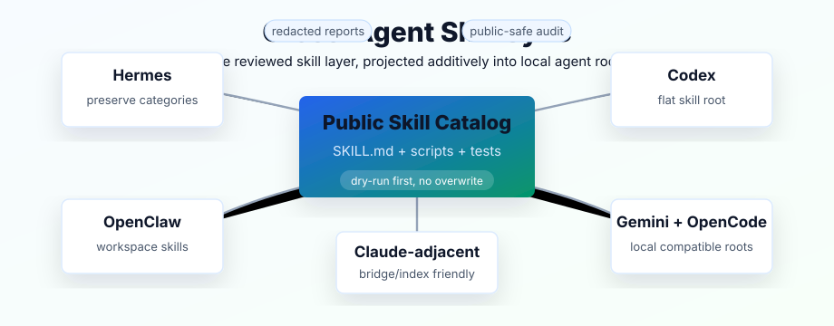
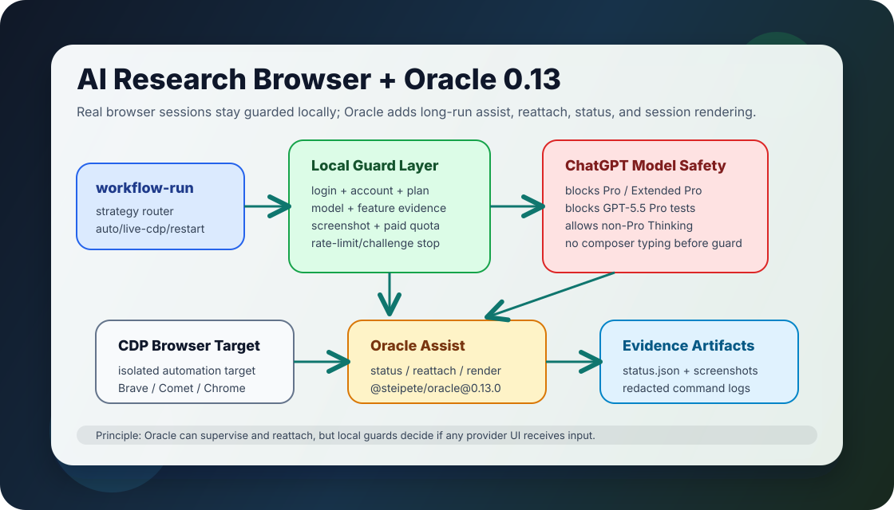
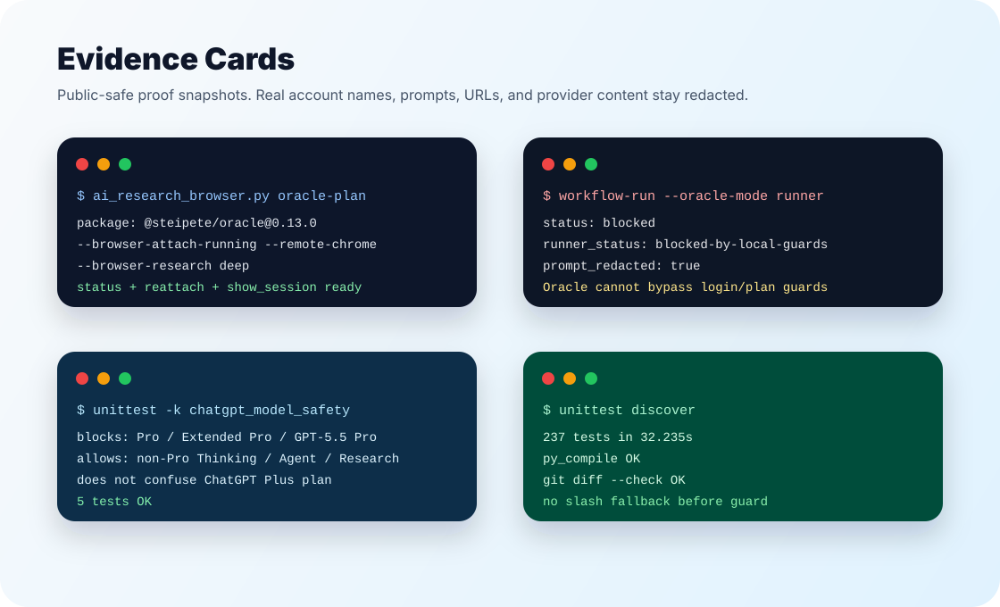

# Martin's Awesome Skills

<p align="center">
  
</p>

<p align="center">
  
</p>

<p align="center">
  
</p>

<p align="center">
  <a href="https://github.com/Martin-Hausleitner/martins-awesome-skills"></a>
  
  
  
  
</p>

> A curated, public-safe collection of reusable agent skills for Hermes Agent, OpenClaw-style workspaces, and other skill-compatible coding agents.

This repo is intentionally **not** a dump of a private OpenClaw/Hermes setup. It contains reusable workflows, templates, tests, and docs that are safe to share. Private memories, sessions, chat exports, account ids, real bot tokens, local machine setup, accounting data, and personal automations stay out.

## Contents

- [Highlights](#-highlights)
- [What's Inside](#-whats-inside)
- [Skill Cards](#-skill-cards)
- [Quick Start](#-quick-start)
- [Featured: Cross-Agent Skill Sync](#-featured-cross-agent-skill-sync)
- [Featured: AI Research Browser + Oracle](#-featured-ai-research-browser--oracle)
- [Featured: Telegram Approval Gate](#-featured-telegram-approval-gate)
- [New Public-Safe Additions](#-new-public-safe-additions)
- [Skill Layout](#-skill-layout)
- [Tests](#-tests)
- [Public Safety Contract](#-public-safety-contract)
- [Docs](#-docs)

## ✨ Highlights

- Human approval gates for external messages
- Dry-run-first Telegram publishing helpers
- Planning, review, debugging, subagent, and TDD playbooks for coding agents
- Cross-agent skill sync for Hermes, Codex, OpenClaw, Gemini, OpenCode, and Claude-adjacent local roots
- GitHub review workflows
- Creative skills for ASCII, Excalidraw, p5.js, songwriting, and AI music workflows
- Research helpers for arXiv, Polymarket, Blogwatcher, Songsee, and YouTube content
- GitHub auth, issues, PR workflow, and review helpers
- Webhook and Notion integration patterns with secret-safe placeholders
- Public-safety audit script included
- GitHub Actions workflow for public safety checks

## 🧰 What's Inside

| Area | Skills | Use For |
|---|---|---|
| 💬 Telegram workflows | `telegram-approval-gate`, `telegram-channel-poster` | Confirm/send/edit/cancel flows and dry-run-first channel publishing |
| 🛠️ Software craft | `plan`, `writing-plans`, `requesting-code-review`, `subagent-driven-development`, `test-driven-development`, `systematic-debugging` | Planning, review, delegation, implementation loops, and debugging |
| 🐙 GitHub | `github-auth`, `github-code-review`, `github-issues`, `github-pr-workflow` | Auth setup, issue triage, structured review, and pull request lifecycle |
| 🎨 Creative tools | `ascii-art`, `excalidraw`, `p5js`, `songwriting-and-ai-music` | Visual explanations, sketches, animations, songs, and terminal-friendly art |
| 🔎 Research | `arxiv`, `blogwatcher`, `polymarket`, `songsee`, `youtube-content` | Paper search, market research, blog/video/music discovery workflows |
| 📄 Productivity | `notion`, `ocr-and-documents` | Notion API patterns and OCR/document extraction workflow guidance |
| 📬 Email tooling | `himalaya` | IMAP/SMTP CLI workflows with explicit-send safety |
| 🧭 Search & analysis | `multi-search-engine`, `tool-comparison-heatmap` | Multi-engine search and comparison visuals |
| 📍 Local discovery | `find-nearby` | Nearby place lookup workflow templates |
| 🔌 MCP | `native-mcp` | Native Model Context Protocol server setup patterns |
| ⚙️ DevOps | `webhook-subscriptions` | Event-driven agent activation with signature and dry-run safety |
| 🔁 Skill sync | `cross-agent-skill-sync` | Share `SKILL.md` packages across local agent roots with dry-run plans |

## 🌟 Skill Cards

- 💬 **Approval-first messaging**: Telegram buttons before the agent sends anything external.
- 🧪 **Development discipline**: TDD and systematic debugging for agents that need less drama and more evidence.
- 🧩 **Agent orchestration**: plans, subagents, and review loops for larger work.
- 🎨 **Visual creation**: ASCII, Excalidraw, and p5.js workflows for fast diagrams and explainers.
- 🔬 **Research workflows**: arXiv, Polymarket, and YouTube content helpers.
- 🔌 **Tool plumbing**: MCP setup patterns and multi-search utilities.
- 🔁 **Skill sharing**: additive, dry-run-first projection into local Hermes/Codex/agent skill roots.
- 🐙 **GitHub operating loop**: auth, issues, PRs, and review workflows in one public-safe set.
- ⚙️ **Event bridges**: webhook subscriptions with HMAC-first thinking.
- 🧱 **Reusable templates**: start new skills from `templates/SKILL_TEMPLATE.md`.

## 🚀 Quick Start

Clone the repo:

```bash
git clone https://github.com/Martin-Hausleitner/martins-awesome-skills.git
cd martins-awesome-skills
```

Copy a skill into your local agent skill directory:

```bash
mkdir -p ~/.hermes/skills/messaging
cp -R skills/telegram-approval-gate ~/.hermes/skills/messaging/
```

For Codex/OpenClaw-style workspaces, copy into the workspace skill folder:

```bash
mkdir -p ~/.openclaw/workspace/skills
cp -R skills/telegram-channel-poster ~/.openclaw/workspace/skills/
```

## 🔁 Featured: Cross-Agent Skill Sync

`cross-agent-skill-sync` shares reviewed `SKILL.md` packages across local agent ecosystems without copying private state. It is built for Hermes, Codex, OpenClaw-style workspaces, Gemini CLI, OpenCode, Claude-adjacent roots, and other local skill-compatible agents.

<p align="center">
  
</p>

Safe defaults:

- **Plan first:** no filesystem writes unless `--execute` is passed.
- **No overwrites:** existing skill folders are reported as `exists` or `conflict`, not replaced.
- **Private-path redaction:** reports hide the home directory by default.
- **Bridge-friendly:** local skills outside this repo can be included with `--include-skill`.
- **Public-safe:** the repo ships deterministic tests and an audit script before publish.

Plan a local projection:

```bash
node skills/software-development/cross-agent-skill-sync/scripts/cross_agent_skill_sync.mjs \
  --target all \
  --require-skill cross-agent-skill-sync
```

Execute an additive same-machine sync after review:

```bash
node skills/software-development/cross-agent-skill-sync/scripts/cross_agent_skill_sync.mjs \
  --target all \
  --strategy symlink \
  --execute
```

## 🧠 Featured: AI Research Browser + Oracle

`ai-research-browser` is the repo's most advanced browser-automation skill. It coordinates real Brave/Comet/Chrome CDP sessions, provider login/plan/model guards, ChatGPT/Gemini Deep Research workflows, rate-limit-safe pacing, and Oracle 0.13 long-run supervision.

<p align="center">
  
</p>

<p align="center">
  
</p>

Why it matters:

- **Real-session first:** `workflow-run --strategy auto` prefers verified live CDP and refuses silent clone/sibling fallback for real ChatGPT/Gemini E2E.
- **Oracle as supervisor:** `--oracle-mode assist|runner` adds `@steipete/oracle@0.13.0` status, reattach, and session-render commands to the same workflow payload.
- **Local guards stay in charge:** Oracle cannot bypass login, account, plan, feature, screenshot, paid-quota, challenge, rate-limit, or ChatGPT model-safety checks.
- **Cost safety:** ChatGPT Pro/Extended Pro/GPT-5.5 Pro are blocked before typing in automated tests; non-Pro Thinking, Agent, and Deep Research paths are preferred.
- **Evidence-first:** runs write `status.json`, screenshot paths, target ids, redacted command logs, and Oracle reattach instructions.
- **Hermes-testable:** `oracle-ai-research-e2e` installs as a local Hermes skill and ships a deterministic checker for the combined GitHub/local workflow.

Try a public-safe Oracle plan:

```bash
python3 skills/software-development/ai-research-browser/scripts/ai_research_browser.py oracle-plan \
  --prompt "Review the current failed E2E browser workflow." \
  --provider chatgpt \
  --mode deep-research \
  --remote-chrome 127.0.0.1:9223 \
  --research-depth deep \
  --browser-attachment-timeout 240
```

Run the guarded integration path:

```bash
python3 skills/software-development/ai-research-browser/scripts/ai_research_browser.py workflow-run \
  --browser brave \
  --profile work \
  --provider chatgpt \
  --mode agent \
  --strategy auto \
  --oracle-mode assist \
  --allow-paid-quota-use \
  --prompt "Debug why Oracle reattach should supervise long browser research."
```

Read the full skill docs: [AI Research Browser](skills/software-development/ai-research-browser/README.md).

Run the dedicated local proof skill:

```bash
python3 skills/software-development/oracle-ai-research-e2e/scripts/oracle_ai_research_e2e_check.py --quick --json
```

## 💬 Featured: Telegram Approval Gate

`telegram-approval-gate` makes external communication safer. Before an agent sends a message, post, reply, or email, it routes the final draft through Telegram buttons:

```text
Senden      Bearbeiten
Abbrechen
```

Local fake-Telegram E2E test:

```bash
python3 skills/telegram-approval-gate/tests/test_telegram_approval_gate.py
```

Dry run:

```bash
python3 skills/telegram-approval-gate/scripts/telegram_approval_gate.py \
  --dry-run \
  --title "Approval Preview" \
  --draft "Ship this?"
```

Live use needs a **dedicated approval bot**, not the same bot token used by a running Hermes/OpenClaw gateway:

```bash
cp config-templates/hermes-approval.env.example .env.telegram-approval
```

Then fill the copied private file with your own values. Do not commit it.

## 🆕 New Public-Safe Additions

- `github-auth`: diagnose and configure GitHub access without leaking tokens.
- `github-issues`: create, triage, label, and close issues with clean public summaries.
- `github-pr-workflow`: branch, commit, test, push, and open pull requests.
- `webhook-subscriptions`: design event-driven agent triggers with explicit signature checks.
- `notion`: use the Notion API with placeholder-only examples and narrow permissions.
- `templates/SKILL_TEMPLATE.md`: a safe starting point for new skills.
- `.github/workflows/public-safety.yml`: CI guardrail for audit and Telegram tests.
- `docs/SKILL_SYNC_ORCHESTRATION.md`: public-safe plan for syncing skills, MCP servers, prompts, and agent configs across tools.
- `scripts/skill-sync-doctor.mjs`: prototype inventory/doctor for public-safe skill sync manifests.
- `cross-agent-skill-sync`: local projector that can install reviewed skills into discovered agent roots without overwrites.

Run the skill sync prototype:

```bash
node scripts/skill-sync-doctor.mjs --root skills --root docs --out /tmp/skill-sync-manifest.json
node scripts/skill-sync-doctor.mjs --root skills --emit codex --emit gemini --emit-dir /tmp/skill-sync-generated
```

Plan a local additive projection into known agent roots:

```bash
node skills/software-development/cross-agent-skill-sync/scripts/cross_agent_skill_sync.mjs --target all
```

## 🗂️ Skill Layout

```text
skills/
  analysis/
    tool-comparison-heatmap/
  creative/
    ascii-art/
    excalidraw/
    p5js/
    songwriting-and-ai-music/
  devops/
    webhook-subscriptions/
  email/
    himalaya/
  github/
    github-auth/
    github-code-review/
    github-issues/
    github-pr-workflow/
  leisure/
    find-nearby/
  mcp/
    native-mcp/
  media/
    songsee/
    youtube-content/
  productivity/
    notion/
    ocr-and-documents/
  research/
    arxiv/
    blogwatcher/
    polymarket/
  search/
    multi-search-engine/
  software-development/
    ai-research-browser/
    cross-agent-skill-sync/
    oracle-ai-research-e2e/
    plan/
    requesting-code-review/
    subagent-driven-development/
    systematic-debugging/
    test-driven-development/
    writing-plans/
  telegram-approval-gate/
  telegram-channel-poster/
```

Every skill keeps its own `SKILL.md` as the entry point. Larger references and deterministic helpers live next to the skill under `references/`, `scripts/`, or `templates/`.

## ✅ Tests

Run the currently bundled executable tests:

```bash
python3 skills/telegram-approval-gate/tests/test_telegram_approval_gate.py
(cd skills/telegram-channel-poster && python3 scripts/test_telegram_channel_post.py)
python3 -m unittest discover -s skills/software-development/ai-research-browser/tests -p 'test_ai_research_browser.py'
python3 -m unittest discover -s skills/software-development/oracle-ai-research-e2e/tests -p 'test_*.py'
node --test skills/software-development/cross-agent-skill-sync/tests/cross_agent_skill_sync.test.mjs
```

Run the public safety scan:

```bash
scripts/audit-public-safety.sh
```

## 🔐 Public Safety Contract

This repo should never contain:

- real `.env` files
- bot tokens, GitHub tokens, OAuth secrets, private keys, cookies, or auth databases
- `MEMORY.md`, `USER.md`, private session logs, chat exports, transcripts, or trajectory files
- accounting, health, location, clipboard, Find My, or personal automation data
- machine-specific paths from a private setup

See [docs/SECURITY.md](docs/SECURITY.md) for the full checklist.

## 📚 Docs

- [Skill Catalog](docs/SKILL_CATALOG.md)
- [Install Skills](docs/INSTALL.md)
- [Security Checklist](docs/SECURITY.md)
- [Contributing Skills](docs/CONTRIBUTING_SKILLS.md)
- [Private Setup Boundary](docs/PRIVATE_SETUP_BOUNDARY.md)
- [Gallery](docs/GALLERY.md)
- [Release Checklist](docs/RELEASE_CHECKLIST.md)
- [Skill Template](templates/SKILL_TEMPLATE.md)

## 💡 Why This Exists

Agent skills are a lovely little format: small, searchable, portable, and easy to test. This repo collects the useful parts of real workflows while leaving the private operational surface behind the curtain where it belongs.

Build sharp tools. Keep secrets boring. Let the buttons save you from accidental sends.
